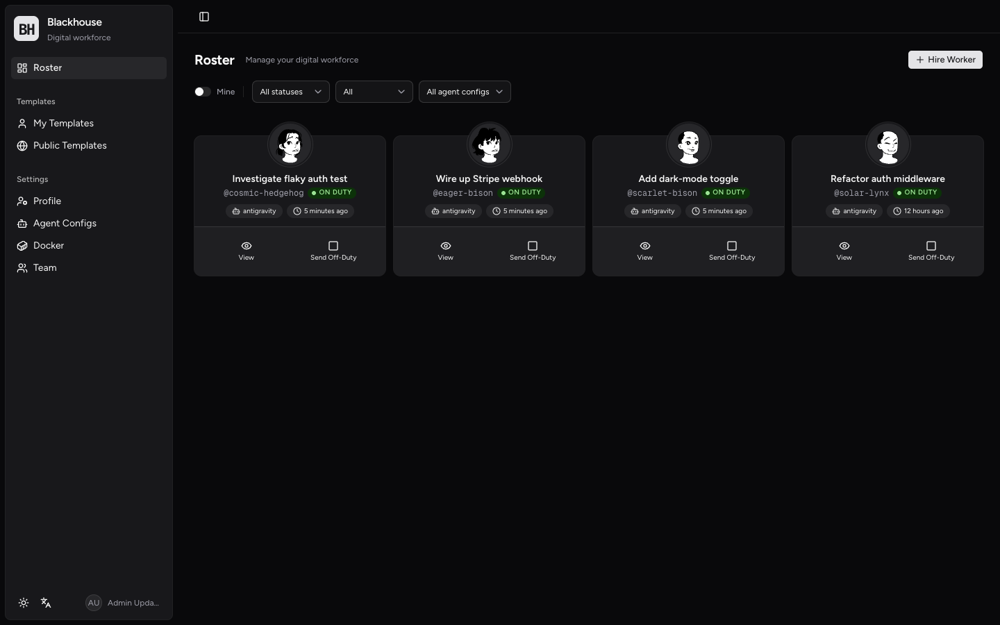
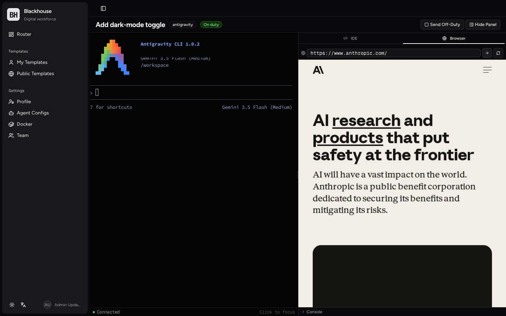

# Blackhouse

[](https://github.com/bytevet/blackhouse/actions/workflows/ci.yml)
[](https://github.com/bytevet/blackhouse/actions/workflows/docker-publish.yml)
[](https://github.com/bytevet/blackhouse/pkgs/container/blackhouse)

Self-hosted control plane for coding agents. Hire a worker, ship it a task, watch it work — each agent runs in its own Docker container with a live terminal, an embedded VS Code IDE, and an embedded browser the agent can drive itself.



A roster of digital workers, each tied to a containerized agent (Claude Code, Antigravity, Codex). Hire, send off-duty, re-spawn, dismiss — same vocabulary you'd use with a real team.



Inside a session: live agent terminal on the left, embedded IDE / Result / Browser tabs on the right. The browser pane is a real Chromium running inside the container — the agent's `$BROWSER` shim navigates it, you watch it stream back as H.264 over a single binary WebSocket.

## Features

- **Three agent presets out of the box** — Claude Code, Antigravity, Codex. Each ships its own Dockerfile, entry command, credential volumes, and skill installer.
- **Live terminal** — xterm.js with WebGL rendering, binary WebSocket protocol, multi-tab broadcast, 256 KB scrollback replay on reconnect.
- **Embedded IDE** — A full code-server (VS Code) running inside the container, proxied as an iframe with `Content-Security-Policy: frame-ancestors 'self'`. File tree, integrated terminal, extensions — survives tab switches without reloading.
- **Embedded browser** — Each container also runs a headless Chromium under Playwright. CDP screencast → libx264 → binary WebSocket → WebCodecs `VideoDecoder` on a `<canvas>`. Input (mouse, keyboard, wheel, contextmenu) round-trips as binary opcodes over the same socket. The agent's `$BROWSER` shim navigates this pane, so `npm`, `gh`, `vite open` all just work from inside the container.
- **Skills system** — Agents install skills at boot via `npx skills add` from `.well-known/agent-skills/`. Ships a default `blackhouse` skill (`browser.sh`, `submit-result.sh`, `update-title.sh`).
- **Templates** — Reusable system prompts + git requirements. Public + private scopes.
- **Result viewer** — Agents POST rich HTML results via token auth; renders in a sandboxed iframe.
- **i18n** — English + Simplified Chinese, language switcher in the sidebar, `Intl.RelativeTimeFormat`-backed date formatting.
- **Role-based access** — Admin and user roles with per-route guards via Better Auth.
- **Type-safe API** — Hono RPC client with end-to-end type inference; e2e tests probe the binary WS contract directly.
- **Dark / light theme** — Persistent across reloads.
- **Responsive** — Desktop and mobile layouts with resizable, mountable panels (browser/IDE state survives tab switches).

## Tech Stack

- **Server** — [Hono](https://hono.dev) (REST + WS), [@hono/node-ws](https://hono.dev/docs/helpers/websocket)
- **Client** — [React 19](https://react.dev) + [React Router v7](https://reactrouter.com) + [hono/client](https://hono.dev/docs/guides/rpc) type-safe RPC
- **UI** — [shadcn/ui](https://ui.shadcn.com) on [base-ui](https://base-ui.com) primitives, [Tailwind CSS v4](https://tailwindcss.com)
- **Database** — [PostgreSQL](https://www.postgresql.org) + [Drizzle ORM](https://orm.drizzle.team)
- **Auth** — [Better Auth](https://www.better-auth.com) (username/password, admin plugin, optional GitHub OAuth)
- **Containers** — [dockerode](https://github.com/apocas/dockerode) — Docker + Podman socket compatible
- **Terminal** — [xterm.js](https://xtermjs.org) with WebGL renderer
- **IDE in browser** — [code-server](https://github.com/coder/code-server)
- **Browser in browser** — [Playwright](https://playwright.dev) + headless Chromium + ffmpeg (libx264 zerolatency) + [WebCodecs](https://developer.mozilla.org/en-US/docs/Web/API/WebCodecs_API) `VideoDecoder`
- **i18n** — [i18next](https://www.i18next.com) + [react-i18next](https://react.i18next.com)
- **Build** — [Vite](https://vite.dev) (client), [tsx](https://tsx.is) (server)
- **Testing** — [Vitest](https://vitest.dev) (unit, 177 tests) + [Playwright](https://playwright.dev) (e2e, 39 tests including docker-gated suite)

## Quick Start (Docker Compose)

```bash
git clone https://github.com/bytevet/blackhouse.git
cd blackhouse

cp .env.example .env
echo "BETTER_AUTH_SECRET=$(openssl rand -base64 32)" >> .env

docker compose up -d

# Generated admin password (only if you didn't set ADMIN_PASSWORD)
docker compose logs app | grep password
```

App runs on http://localhost:3000. Migrations run automatically on first boot; the default admin user is created from `ADMIN_PASSWORD` if set, otherwise a random password is printed to the server logs.

### Podman on macOS

Podman's socket lives inside its VM. Point Blackhouse at it:

```bash
echo "DOCKER_HOST_SOCKET=/run/podman/podman.sock" >> .env
docker compose up -d
```

### Build agent images

Sessions can't spawn until at least one agent preset has a built image:

1. **Settings → Agent Configs**
2. Click **Build** next to the preset you want
3. Watch the build log; first build downloads Chromium, code-server, and Node, so plan for ~5–10 minutes and ~3 GB per preset

Heads-up: building all three presets concurrently can pressure Podman's default VM memory cap (3.8 GB). Build one at a time, or bump the cap (`podman machine set --memory 8192 && podman machine start`).

### Hire a worker

1. **Dashboard** → **Hire Worker**
2. Pick an agent, optionally choose a template + git repo
3. The session page opens with terminal connected; click the right-edge panel to reveal IDE / Browser / Result tabs

## Local Development

### Prerequisites

- Node.js 22+
- Docker or Podman (with the socket reachable — see env vars below)
- PostgreSQL 17+ (the docker-compose ships one)

### Setup

```bash
npm install
cp .env.example .env

# Push schema (or run migrations: npm run db:migrate)
npm run db:push

# Vite (5173) + Hono (3000) concurrently
npm run dev
```

- **SPA**: http://localhost:5173 (Vite — proxies API + WS to Hono)
- **API**: http://localhost:3000 (Hono)

Set `ADMIN_PASSWORD` in `.env` before the first run, or check server logs for the generated one.

### Scripts

```bash
npm run dev            # Vite (5173) + Hono (3000) with hot reload
npm run dev:client     # Vite only
npm run dev:server     # Hono only (tsx watch)
npm run build          # Production client bundle
npm run start          # Production server
npm test               # Vitest unit tests
npm run format         # Prettier --write
npm run format:check   # CI gate
npm run check:playwright  # Guard: playwright runtime matches @playwright/test
npx playwright test    # Non-docker e2e (24 tests, ~20s)
E2E_DOCKER=1 npx playwright test  # Full suite including container-gated tests (39 tests, ~1.7m)
npm run db:generate    # New migration from schema diff
npm run db:push        # Push schema directly (dev only)
npm run db:seed        # Seed admin user + agent presets
npm run db:studio      # Drizzle Studio
```

### E2E tests against a deployed instance

```bash
E2E_BASE_URL=http://localhost:3000 \
  E2E_ADMIN_USERNAME=admin \
  E2E_ADMIN_PASSWORD=your-password \
  npx playwright test
```

The `E2E_DOCKER` suite hires real agent containers and exercises the IDE + browser pane end-to-end (canvas paint, agent-side `$BROWSER` shim, WS reconnect). Make sure the relevant agent image is built first.

## Project Structure

```
server/                    # Hono API server
├── index.ts               # Mounts routes, serves SPA, runs migrations + seed
├── api/                   # REST handlers (chained for hono/client RPC inference)
│   ├── auth.ts            # Better Auth mount
│   ├── sessions.ts        # Session CRUD + Docker lifecycle
│   ├── templates.ts       # Template CRUD
│   ├── settings.ts        # Agent configs, Docker, users, profile, volumes
│   ├── files.ts           # File explorer + viewer
│   ├── result.ts          # Agent result/title submission (token auth)
│   └── skills.ts          # .well-known/agent-skills endpoint
├── ws/
│   ├── terminal.ts        # Binary WS terminal (0x00 data / 0x01 resize)
│   └── browser.ts         # Browser-pane WS proxy with upstream-open queue + flush
├── proxy/ide.ts           # code-server HTTP + WS proxy with CSP frame-ancestors
├── middleware/auth.ts     # Auth + admin Hono middleware
├── db/                    # Drizzle schema, connection, migrations, seed
└── lib/                   # Docker client, Better Auth, pagination, ws-binary
src/                       # React SPA
├── pages/                 # dashboard, session, templates, settings, login
├── components/
│   ├── browser-viewer.tsx # WebCodecs canvas + binary WS opcode demux
│   ├── ide-viewer.tsx     # code-server iframe
│   ├── result-viewer.tsx  # Sandboxed agent result iframe
│   └── ui/                # shadcn/ui (DO NOT modify)
├── lib/
│   ├── browser-input-codec.ts  # Binary WS wire format (opcodes 0x01–0x86)
│   ├── browser-ws-rpc.ts       # Request/response correlation for WS opcodes
│   └── api.ts                  # hono/client RPC instance
└── i18n/                  # en + zh-CN translation tables
agent/                     # COPY'd into every agent container at image-build time
├── dockerfiles/           # Per-preset Dockerfile (claude-code / antigravity / codex)
├── browser-service/       # In-container Playwright + ffmpeg + WS server
├── entrypoint.sh          # Boots browser-service + code-server + agent CLI
└── skills/blackhouse/     # Default skill set — browser.sh, submit-result.sh, etc.
scripts/
├── smoke-browser-ws.ts    # Node-side wire-format smoke for the browser pane
└── redact-email.mjs       # One-shot redactor used to prep these screenshots
tests/
├── unit/                  # Vitest: codec round-trip, RPC, schema, helpers
└── e2e/                   # Playwright: session lifecycle, IDE, browser, settings
```

## Wire format — embedded browser pane

The browser pane talks to the in-container Playwright via a single binary WebSocket at `/api/browser-ws/:sessionId`. Frame layout: `opcode(u8) + reqId(u32 BE) + payload`, big-endian throughout.

Client → server:

```
0x01–0x07  input events (mouse, keyboard, wheel, char) — fire-and-forget
0x10       control: navigate / back / forward / reload / resize — fire-and-forget
0x11       eval: arbitrary JS in the in-container page (req/resp)
0x12       state: project URL/title/loading/selection/scroll/contextMenu by flag bits
```

Server → client:

```
0x80       config: codedWidth, codedHeight, codec — sent at open + after resize
0x81       videoFrame: H.264 Annex-B (type, pts, NALU)
0x83       evalResult: ok byte + JSON payload
0x84       stateSnapshot: JSON projection per the requested flag bits
0x85       consoleEvent: pushed on Page.consoleAPICalled / Runtime.exceptionThrown
0x86       navigateEvent: pushed on Page.frameNavigated (top frame only)
```

No REST, no SSE, no JSON-over-WS fallback. The one exception is an in-container loopback `POST /browser/control` on `127.0.0.1:9223` used exclusively by the agent's `$BROWSER` shim — not exposed by the proxy.

## Environment Variables

| Variable                   | Purpose                                                                                                                                                                                                                                                                         | Default                                                                      |
| -------------------------- | ------------------------------------------------------------------------------------------------------------------------------------------------------------------------------------------------------------------------------------------------------------------------------- | ---------------------------------------------------------------------------- |
| `BETTER_AUTH_SECRET`       | Auth session signing key (**required**)                                                                                                                                                                                                                                         | —                                                                            |
| `BETTER_AUTH_URL`          | Public URL of the app                                                                                                                                                                                                                                                           | `http://localhost:3000`                                                      |
| `ADMIN_PASSWORD`           | Initial admin password (random if omitted)                                                                                                                                                                                                                                      | —                                                                            |
| `POSTGRES_PASSWORD`        | Database password                                                                                                                                                                                                                                                               | `blackhouse`                                                                 |
| `DATABASE_URL`             | PostgreSQL connection string (local dev)                                                                                                                                                                                                                                        | —                                                                            |
| `BLACKHOUSE_CONTAINER_URL` | URL agent containers use to reach Blackhouse                                                                                                                                                                                                                                    | `http://host.docker.internal:3000` (dev) / `http://app:3000` (compose)       |
| `BLACKHOUSE_NETWORK`       | When set, every spawned agent container attaches to this Docker network so the app can reach it by container IP + internal port (bypassing host port mapping). Required when Blackhouse itself runs inside a container — e.g. via `compose.yml`, which sets it to `blackhouse`. | — (unset = local-dev path: agent maps ports to host `127.0.0.1:<ephemeral>`) |
| `DOCKER_HOST_SOCKET`       | Docker / Podman socket path                                                                                                                                                                                                                                                     | `/var/run/docker.sock`                                                       |
| `PORT`                     | Host port for the app                                                                                                                                                                                                                                                           | `3000`                                                                       |
| `GITHUB_CLIENT_ID`         | GitHub OAuth (optional)                                                                                                                                                                                                                                                         | —                                                                            |
| `GITHUB_CLIENT_SECRET`     | GitHub OAuth (optional)                                                                                                                                                                                                                                                         | —                                                                            |
| `E2E_DOCKER`               | When set, Playwright suite runs the container-gated tests; caps workers at 2                                                                                                                                                                                                    | —                                                                            |

## License

Private
